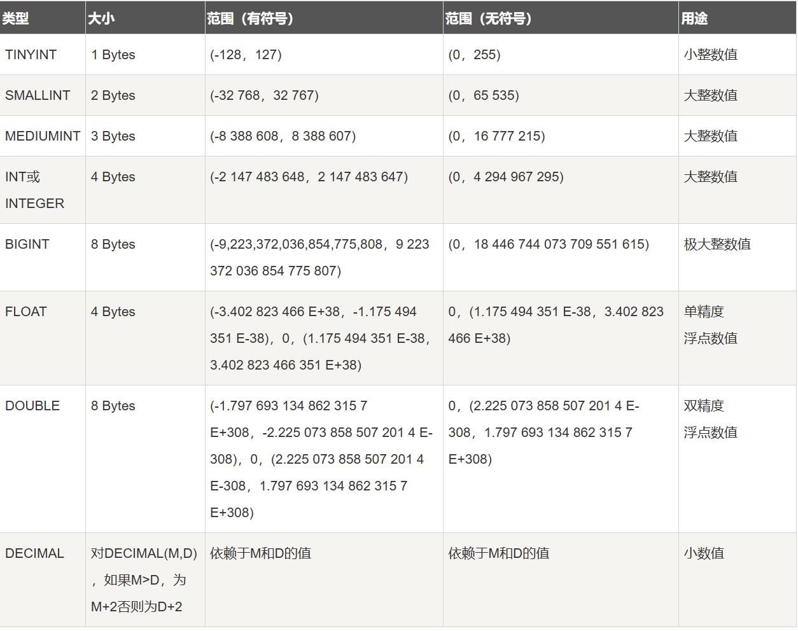
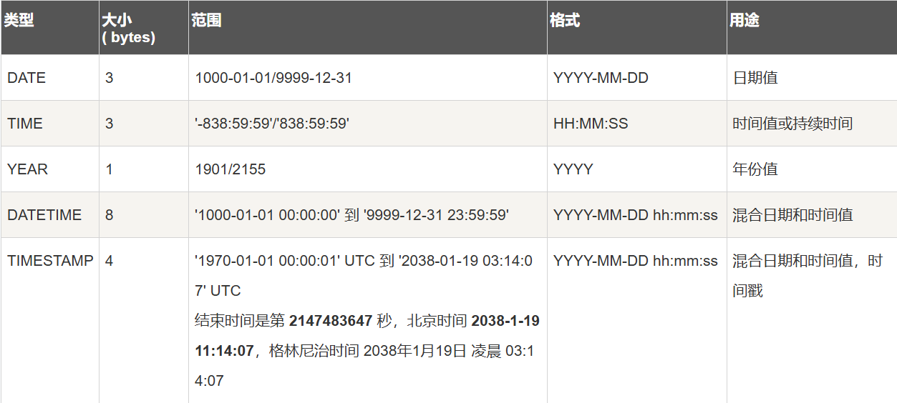
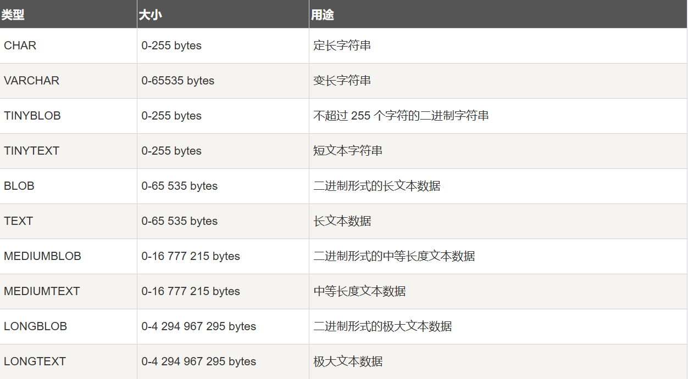
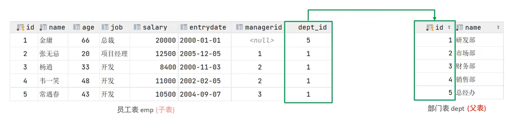
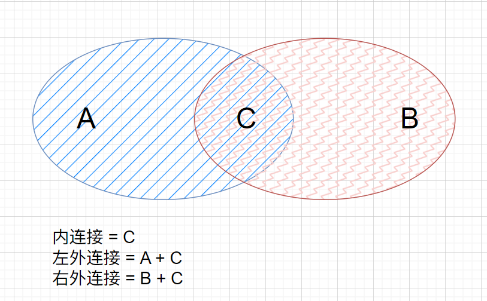
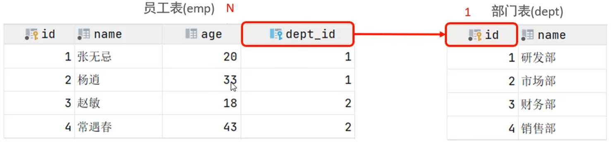
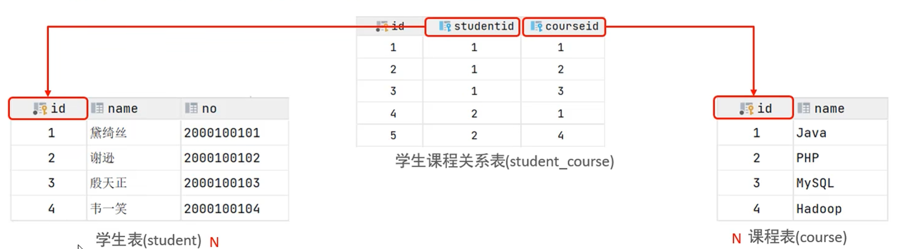
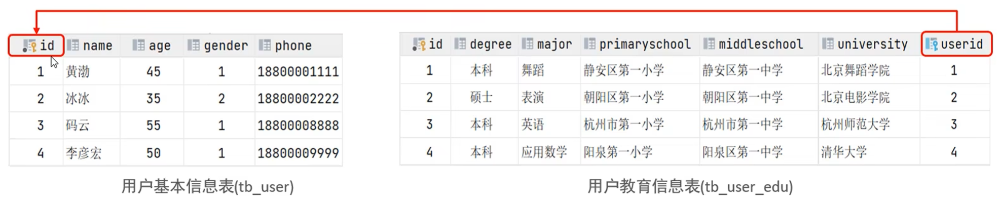

- **启动与停止**

  - 启动

    ```shell
    net start mysql80
    ```

  - 停止

    ```shell
    net stop mysql80
    ```

- **客户端连接**

  ```shell
  mysql [-h 127.0.0.1] [-P 3306] -u root -p
  ```

## SQL

### SQL 通用语法

1. SQL语句可以单行或多行书写，以分号结尾
2. SQL语句可以使用空格/缩进来增强语句的可读性
3. MySQL数据库的SQL语句不区分大小写，关键字建议使用大写
4. 注释：
   - 单行：`-- 注释内容` / `# 注释内容`
   - 多行： `/* 注释内容 */`

### SQL 分类

| 分类 | 全称                       | 说明                                                   |
| ---- | -------------------------- | ------------------------------------------------------ |
| DDL  | Data Definition Language   | 数据定义语言，用来定义数据库对象（数据库、表、字段）   |
| DML  | Data Manipulation Language | 数据操作语言，用来对数据库表中的数据进行增删改         |
| DQL  | Data Query Language        | 数据查询语言，用来查询数据库中表的记录                 |
| DCL  | Data Control Language      | 数据控制语言，用来创建数据库用户，控制数据库的访问权限 |

---

#### DDL

##### 数据库操作

1. **查询**

   - 查询所有数据库

     ```
     SHOW DATABASES;
     ```

   - 查询当前数据库

     ```
     SELECT DATABASE();
     ```

2. **创建**

   ```
   CREATE DATABASE [IF NOT EXISTS] 数据库名 [DEFAULT CHARSET 字符集] [COLLATE 排序规则];
   ```

3. **删除**

   ```
   DROP DATABASE [IF EXISTS] 数据库名;
   ```

4. **使用**

   ```
   USE 数据库名;
   ```

##### 表操作

1. **查询**

   - 查询当前数据库所有表

     ```
     SHOW TABLES;
     ```

   - 查询表结构

     ```
     DESC 表名;
     ```

   - 查询指定表的建表语句

     ```
     SHOW CREATE TABLE 表名;
     ```

2. **创建**

   ```
   CREATE TABLE 表名(
   	字段1 字段1类型[COMMENT 字段1注释],
       字段2 字段2类型[COMMENT 字段2注释],
       字段3 字段3类型[COMMENT 字段3注释],
       ......
       字段n 字段n类型[COMMENT 字段n注释]
   )[COMMENT 表注释];
   ```

3. **修改**

   - 添加字段

     ```
     ALTER TABLE 表名 ADD 字段名 类型(长度) [COMMENT 注释] [约束];
     ```

   - 修改字段

     ```
     #修改数据类型
     ALTER TABLE 表名 MODIFY 字段名 新数据类型(长度);
     
     #修改字段名和数据类型
     ALTER TABLE 表名 CHANGE 旧字段名 新字段名 类型(长度) [COMMENT 注释] [约束];
     ```

   - 删除字段

     ```
     ALTER TABLE 表名 DROP 字段;
     ```

   - 修改表名

     ```
     ALTER TABLE 表名 RENAME TO 新表名;
     ```

4. **删除**

   - 删除表

     ```
     DROP TABLE [IF EXISTS] 表名;
     ```

   - 删除指定表，并重新创建该表

     ```
     TRUNCATE TABLE 表名;
     ```

##### 数据类型

- **数值类型**

  > 无符号-UNSIGNED
  {: .prompt-info }

  

- **日期和时间类型**

  

- **字符串类型**

  

---

#### DML

##### 添加数据

1. **给指定字段添加数据**
   
   ```
   INSERT INTO 表名 (字段名1, 字段名2, ...) VALUES (值1, 值2, ...);
   ```
   
2. **给全部字段添加数据**

   ```
   INSERT INTO 表名 VALUES (值1, 值2, ...);
   ```

3. **批量添加数据**

   ```
   # 为表中指定字段进行赋值
   INSERT INTO 表名 (字段名1, 字段名2, ...) VALUES (值1, 值2, ...), (值1, 值2, ...);
   
   # 为表中所有字段进行赋值
   INSERT INTO 表名 VALUES (值1, 值2, ...), (值1, 值2, ...), (值1, 值2, ...);
   ```


##### 修改数据

```
UPDATE 表名 SET 字段名1 = 值1, 字段名2 = 值2, ... [WHERE 条件];
```

> 没有条件会修改整张表的数据
{: .prompt-tip }

##### 删除数据

```
DELETE FROM 表名 [WHERE 条件]
```

> 没有条件删除整张表所有数据
> DELETE 语句不能删除某一个字段的值（可以使用UPDATE设置为null）
{: .prompt-tip }

---

#### DQL

##### 语法

```
SELECT 
	字段列表
FROM
	表名列表
WHERE
	条件列表
GROUP BY
	分组字段列表
HAVING
	分组后条件列表
ORDER BY
	排序字段列表
LIMIT
	分页参数
```

##### 查询

###### 1. 基本查询

- 查询多个字段

  ```
  SELECT 字段1, 字段2, 字段3, ... FROM 表名;
  
  # 查询返回所有字段
  SELECT * FROM 表名;
  ```

- 设置别名

  ```
  SELECT 字段1 [AS 别名1], 字段2 [AS 别名2] ... FROM 表名;
  ```

- 去除重复记录

  ```
  SELECT DISTINCT 字段列表 FROM 表名;
  ```

---

###### 2. 条件查询（WHERE）

- 语法

  ```
  SELECT 字段列表 FROM 表名 WHERE 条件列表;
  ```

- 条件

  | 比较运算符          | 功能                                        |
  | ------------------- | ------------------------------------------- |
  | >                   | 大于                                        |
  | >=                  | 大于等于                                    |
  | <                   | 小于                                        |
  | <=                  | 小于等于                                    |
  | =                   | 等于                                        |
  | <> 或 !=            | 不等于                                      |
  | BETWEEN ... AND ... | 在某个范围之内（含最小、最大值）            |
  | IN(...)             | 在in之后的列表中的值，多选一                |
  | LIKE 占位符         | 模糊匹配（__匹配单个字符, %匹配任意个字符） |
  | IS NULL             | 是NULL                                      |
  | AND 或 &&           | 并且（多个条件同时成立）                    |
  | OR 或 \|\|          | 或者（多个条件任意一个成立）                |
  | NOT 或 !            | 非，不是                                    |

---

###### 3. 聚合查询（count, max, min, avg, sum）

- **介绍**：将一列数据作为一个整体，进行纵向计算 （不计算null值）

- **语法**

  ```
  SELECT 聚合函数(字段列表) FROM 表名;
  ```

- 常见聚合函数

  | 函数  | 功能     |
  | ----- | -------- |
  | count | 统计数量 |
  | max   | 最大值   |
  | min   | 最小值   |
  | avg   | 平均值   |
  | sum   | 求和     |

---

###### 4. 分组查询（GROUP BY)

- 语法

  ```
  SELECT 字段列表 FROM 表名 [WHERE 条件] GROUP BY 分组字段名 [HAVING 分组后过滤条件];
  ```

- WHERE 与 HAVING 区别

  - 执行时机不同：WHERE是分组之前进行过滤，不满足WHERE条件，不参与分组；而HAVING是分组之后对结果进行过滤。
  - 判断条件不同：WHERE不能对聚合函数进行判断，而HAVING可以。

  > - 执行顺序：WHERE > 聚合函数 > HAVING
  > - 分组之后，查询的字段一般为聚合函数和分组字段，查询其他字段无任何意义
  {: .prompt-warning }

---

###### 5. 排序查询（ORDER BY）

- 语法

  ```
  SELECT 字段列表 FROM 表名 ORDER BY 字段1 排序方式1, 字段2 排序方式2;
  ```

- 排序方式

  - ASC：升序（默认值）
  - DESC：降序

  > 如果是多字段排序，当第一个字段值相同时，才会根据第二个字段进行排序
  {: .prompt-info }

---

###### 6. 分页查询（LIMIT）

- 语法

  ```
  SELECT 字段列表 FROM 表名 LIMIT 起始索引, 查询记录数;
  ```

  > - 起始索引从0开始，起始索引 = (查询页码 - 1) * 每页显示记录数
  > - 分页查询是数据库的方言，不同数据库有不同的实现，MySQL中是LIMIT
  > - 如果查询的是第一页数据，起始索引可以省略，直接简写为 LIMIT 10  
  {: .prompt-info }

---

#### DCL

##### 管理用户

1. **查询用户**

   ```
   USE mysql;
   SELECT * FROM user;
   ```

2. **创建用户**

   ```
   CREATE USER '用户名'@'主机名' IDENTIFIED BY '密码';
   
   #主机名使用%表示任意主机都可以访问
   ```

3. **修改用户密码**

   ```
   ALTER USER '用户名'@'主机名' IDENTIFIED WITH my_sql_native_password BY '新密码';
   ```

4. **删除用户**

   ```
   DROP USER '用户名'@'主机名';
   ```

##### 权限控制

1. **常用权限**

   | 权限                | 说明               |
   | ------------------- | ------------------ |
   | ALL, ALL PRIVILEGES | 所有权限           |
   | SELECT              | 查询数据           |
   | INSERT              | 插入数据           |
   | UPDATE              | 修改数据           |
   | DELETE              | 删除数据           |
   | ALTER               | 修改表             |
   | DROP                | 删除数据库/表/视图 |
   | CREATE              | 创建数据库/表      |

2. **查询权限**

   ```
   SHOW GRANTS FOR '用户名'@'主机名';
   ```

3. **授予权限**

   ```
   GRANT 权限列表 ON 数据库名.表名 TO '用户名'@'主机名';
   ```

4. **撤销权限**

   ```
   REVOKE 权限列表 ON 数据库名.表名 FROM '用户名'@'主机名';
   ```

> - 多个权限之间，使用逗号分隔
> - 授权时，数据库名和表名都可以使用 * 进行通配，代表所有
{: .prompt-info }


## 函数

一段可以直接被另一段程序调用的程序或代码

### 语法（直接使用）

```
SELECT 函数(参数);
```

### 常用字符串函数

| 函数                       | 功能                                                     |
| -------------------------- | -------------------------------------------------------- |
| CONCAT(S1, S2, ..., Sn)    | 字符串拼接，将S1, S2, ..., Sn拼接成一个字符串            |
| LOWER(str)                 | 将字符串str全部转为小写                                  |
| UPPER(str)                 | 将字符串str全部转为大写                                  |
| LPAD(str, n, pad)          | 左填充，用字符串pad对str左边进行填充，达到n个字符串长度  |
| RPAD(str, n, pad)          | 右填充， 用字符串pad对str右边进行填充，达到n个字符串长度 |
| TRIM(str)                  | 去掉字符串头部和尾部的空格                               |
| SUBSTRING(str, start, len) | 返回从字符串str从start位置起的len个长度的字符串          |

### 常用数值函数

| 函数        | 功能                               |
| ----------- | ---------------------------------- |
| CEIL(x)     | 向上取整                           |
| FLOOR(x)    | 向下取整                           |
| MOD(x, y)   | 返回x/y的模                        |
| RAND()      | 返回0-1内的随机数                  |
| ROUND(x, y) | 求参数x的四舍五入的值，保留y位小数 |

### 常用日期函数

| 函数                               | 功能                                              |
| ---------------------------------- | ------------------------------------------------- |
| CURDATE()                          | 返回当前日期                                      |
| CURTIME()                          | 返回当前时间                                      |
| NOW()                              | 返回当前日期和时间                                |
| YEAR(date)                         | 获取指定date的年份                                |
| MONTH(date)                        | 获取指定date的月份                                |
| DAY(date)                          | 获取指定date的日期                                |
| DATE_ADD(date, INTERVAL expr type) | 返回一个日期/时间值加上一个时间间隔expr后的时间值 |
| DATEDIFF(date1, date2)             | 返回起始时间date1和结束时间date2之间的天数        |

### 常用流程函数

| 函数                                                   | 功能                                                       |
| ------------------------------------------------------ | ---------------------------------------------------------- |
| IF(value, t, f)                                        | 如果value为true，则返回t，否则返回f                        |
| IFNULL(value1, value2)                                 | 如果value1不为空，返回value1，否则返回value2               |
| CASE WHEN [val1] THEN [res1] ... ELSE [default] END    | 如果val1为true，返回res1， ... 否则返回default默认值       |
| CASE [expr] WHEN [val1] THEN [res1] ELSE [default] END | 如果expr的值等于val1，返回res1， ... 否则返回default默认值 |


## 约束

### 概述

1. **概念**：约束时作用域表中字段上的规则，用于限制存储在表中的数据

2. **目的**：保证数据库中的的**正确、有效性和完整性**

3. **分类**：

   | 约束                      | 描述                                                     | 关键字      |
   | ------------------------- | -------------------------------------------------------- | ----------- |
   | 非空约束                  | 限制该字段的数据不能为null                               | NOT NULL    |
   | 唯一约束                  | 保证该字段的所有数据都是唯一、不重复的                   | UNIQUE      |
   | 主键约束                  | 主键是一行数据的唯一标识，要求非空且唯一                 | PRIMARY KEY |
   | 默认约束                  | 保存数据时，如果未指定该字段的值，则采用默认值           | DEFAULT     |
   | 检查约束 (8.0.16版本之后) | 保证字段值满足某一个条件                                 | CHECK       |
   | 外键约束                  | 用来让两张表的数据之间建立连接，保证数据的一致性和完整性 | FOREIGN KEY |

> 约束是作用域表中字段上的，可以在创建表/修改表的时候添加约束
{: .prompt-warning }

### 例子

| 字段名 | 字段含义   | 字段类型    | 约束条件                  | 约束关键字                                           |
| ------ | ---------- | ----------- | ------------------------- | ---------------------------------------------------- |
| id     | ID唯一标识 | int         | 主键，并且自动增长        | <font color='red'>PRIMARY KEY, AUTO_INCREMENT</font> |
| name   | 姓名       | varchar(10) | 不为空，并且唯一          | <font color='red'>NOT NUL, UNIQUE</font>             |
| age    | 年龄       | int         | 大于0，并且小于等于120    | <font color='red'>CHECK</font>                       |
| status | 状态       | char(1)     | 如果没有指定该值，默认为1 | <font color='red'>DEFAULT</font>                     |
| gender | 性别       | char(1)     | 无                        |                                                      |

```
create table user(
    id int primary key auto_increment comment '主键',
    name varchar(10) not null unique comment '姓名',
    age int check ( age > 0 and age <= 120 ) comment '年龄',
    status char(1) default '1' comment '状态',
    gender char(1) comment '性别'
) comment '用户表';
```


### 外键约束

1. **概念**：外键用来让两张表的数据之间建立连接，从而保证数据的一致性和完整性

   ​	

   > 目前上述的两张表，在数据库层面，并未建立外键关联，所以是无法保证数据的一致性和完整性的
   {: .prompt-warning }

2. **语法**：

   - 添加外键

     ```
     # 创建时添加
     CREATE TABLE 表名(
     	字段名 数据类型,
         ...
         [CONSTRAINT] [外键名称] FOREIGN KEY(外键字段名) REFERENCES 主表(主表列明)
     );
     
     # 对已有的表添加
     ALTER TABLE 表名 ADD CONSTRAINT 外键名称 FOREIGN KEY(外键字段名) REFERENCES 主表(主表列名);
     ```

   - 删除外键

     ```
     ALTER TABLE 表名 DROP FOREIGN KEY 外键名称;
     ```

## 多表查询

概述：从多张表中查询数据

笛卡尔积：两个集合A集合和B集合的所有组合情况（在多表查询时，需要消除无效的笛卡尔积）(`WHERE a.id = b.id`)

**多表查询分类**：

- 连接查询

  - 内连接：相当于查询A、B交集部分数据
  - 外连接
    - 左外连接：查询<font color='red'>左表</font>所有数据，以及两张表交集部分数据
    - 右外连接：查询<font color='red'>右表</font>所有数据，以及两张表交集部分数据
  - 自连接：当前表与自身的连接查询，自连接必须使用表别名s

  

- 子查询


### 多表关系

1. **一对多（多对一）**

   案例：部门与员工的关系

   关系：一个部门对应多个员工，一个员工对应一个部门

   实现：<font color='red'>在多的一方建立外键，只想一的一方的主键</font>

   

2. **多对多**

   案例：学生与课程的关系

   关系：一个学生可以选修多门课程，一门课程也可以供多个学生选择

   实现：<font color='red'>建立第三张中间表，中间表至少包含两个外键，分别关联两方主键</font>

   

3. **一对一**

   案例：用户与用户详情的关系

   关系：一对一关系，多用于单表拆分，将一张表的基础字段放在一张表中，其他详情字段放在另一张表中，以提升操作效率

   实现：<font color='red'>在任意一方加入外键，关联另外一方的主键，并且设置外键为唯一的 (UNIQUE)</font>

   


### 内连接

> 内连接查询的是两张表交集的部分
{: .prompt-tip }

**语法**

- 隐式内连接

  ```
  SELECT 字段列表 FROM 表1, 表2, WHERE 条件...;
  ```

- 显式内连接

  ```
  SELECT 字段列表 FROM 表1 [INNER] JOIN 表2 ON 连接条件...;
  ```


### 外连接

**语法**

- 左外连接

  ```
  SELECT 字段列表 FROM 表1 LEFT [OUTER] JOIN 表2 ON 条件 ...;
  ```

  > 相当于查询表1（左表）的所有数据，包含表1和表2交集部分的数据
  {: .prompt-tip }

- 右外连接

  ```
  SELECT 字段列表 FROM 表1 RIGHT [OUTER] JOIN 表2 ON 条件 ...;
  ```

  > 相当于查询表2（右表）的所有数据，包含表1和表2交集部分的数据
  {: .prompt-tip }


### 自连接

> 自连接查询，可以是内连接查询，也可以是外连接查询
{: .prompt-tip }

**语法**

```
SELECT 字段列表 FROM 表A 别名A [INNER / LEFT OUTER / RIGHT OUTER] JOIN 表A 别名B ON 条件 ...;
```


### 联合查询 - union, union all

对于union查询，就是把多次查询的结果合并起来，形成一个新的查询结果集

```
SELECT 字段列表 FROM 表A ...
UNION [ALL] # union all 直接合并, union 合并后去重
SELECT 字段列表 FROM 表B ...;
```

> - 联合查询的多张表的列数必须保持一致，字段类型也需保持一致
> - union all 会将全部的数据直接合并在一起，union会对合并之后的数据去重
{: .prompt-warning }


### 子查询

1. **概念**：SQL语句中嵌套SELECT语句，成为*嵌套查询*，又称*子查询*

   ```
   SELECT * FROM t1 WHERE column1 = (SELECT column1 FROM t2);
   ```

   > 子查询外部的语句可以是 INSERT / UPDATE / DELETE / SELECT 的任何一个
   {: .prompt-warning }

2. 根据子查询结果不同，分为：

   - 标量子查询（子查询结果为单个值）

     > 常用操作符：=, <>, >, >=, <, <=

   - 列子查询（子查询结果为一列）

     > 常用操作符：IN, NOT  IN, ANY, SOME, ALL
     >
     > | 操作符 | 描述                                   |
     > | ------ | -------------------------------------- |
     > | IN     | 在指定的集合范围之内，多选一           |
     > | NOT IN | 不在指定的集合范围之内                 |
     > | ANY    | 子查询返回列表中，有任意一个满足即可   |
     > | SOME   | 与ANY等同，使用SOME的地方都可以使用ANY |
     > | ALL    | 子查询返回烈火表的所有值都必须满足     |

   - 行子查询（子查询结果为一行）

     > 常用操作符：=, <>, IN, NOT IN

   - 表子查询（子查询结果为多行多列）

     > 常用操作符：IN

3. 根据子查询位置，分为：WHERE之后，FROM之后，SELECT之后

## 事务

### 简介

事务是一组操作的集合，不可分割的工作单位，事务会把所有的操作作为一个整体一起向系统提交或撤销操作请求，即这些操作<font color='red'>要么同时成功，要么同时失败</font>。

> 默认MySQL的事务时自动提交的，也即是说，当执行一条DML语句，MySQL会立即隐式的提交事务。
{: .prompt-info }

### 操作


### 四大特性

### 并发事务问题

### 事务隔离级别

