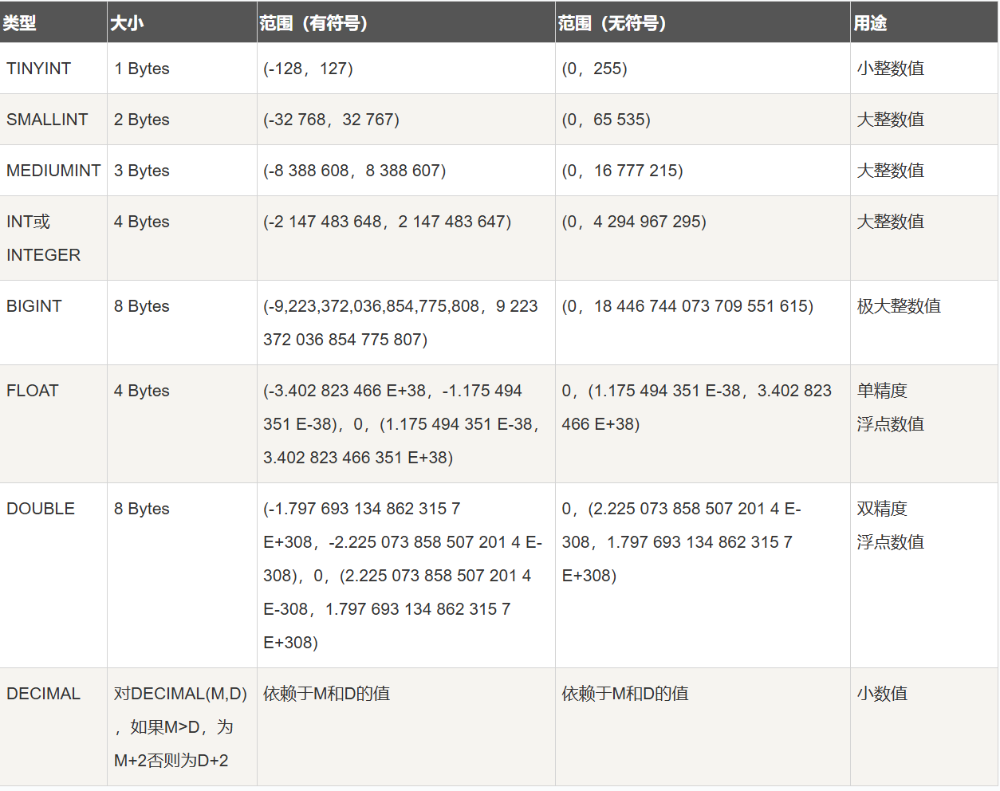
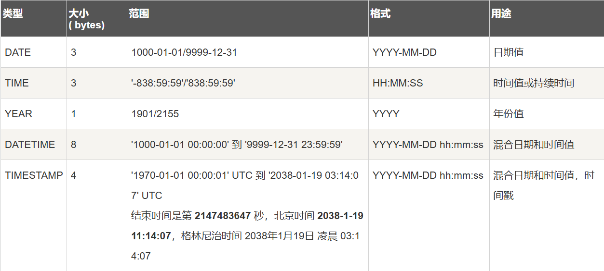
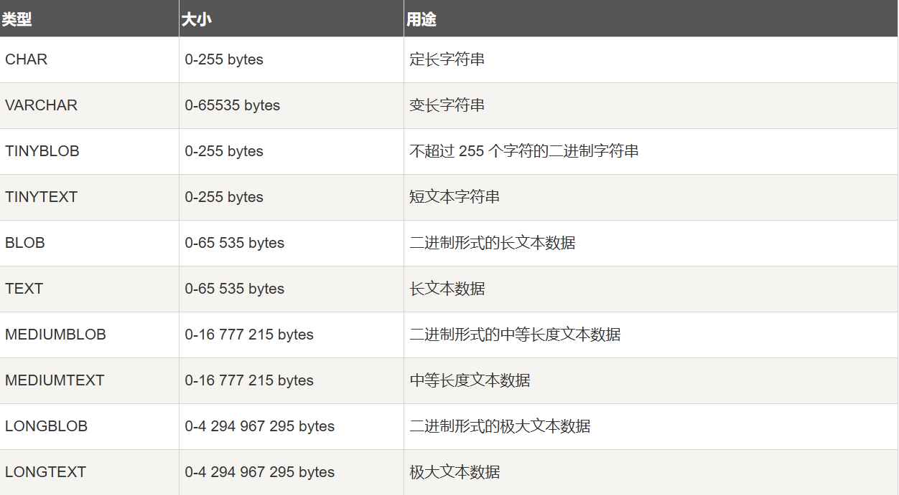
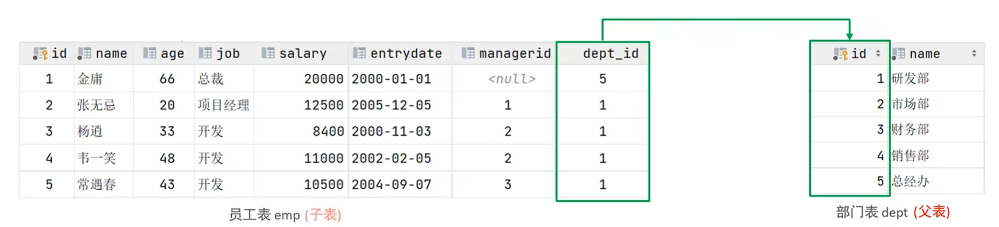
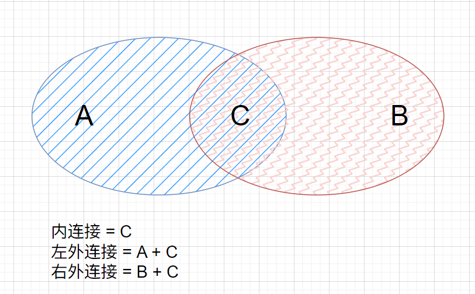
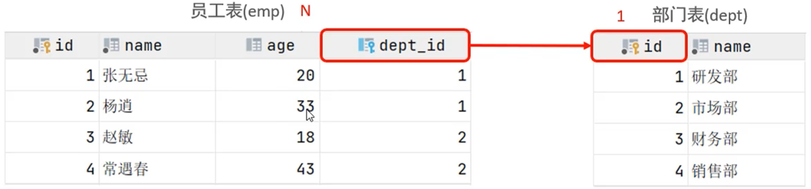
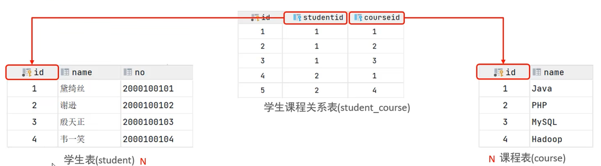
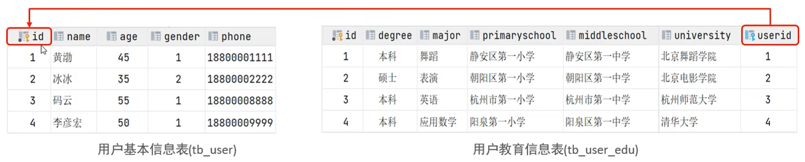

[【黑马程序员 MySQL数据库入门到精通，从mysql安装到mysql高级、mysql优化全囊括】]( https://www.bilibili.com/video/BV1Kr4y1i7ru/?p=103&share_source=copy_web&vd_source=2672121c37173b0cc6b623f529eb77f2)

- **启动与停止**

  - 启动

    ```shell
    net start mysql80
    ```

  - 停止

    ```shell
    net stop mysql80
    ```

- **客户端连接**

  ```shell
  mysql [-h 127.0.0.1] [-P 3306] -u root -p
  ```

## SQL

### SQL 通用语法

1. SQL语句可以单行或多行书写，以分号结尾
2. SQL语句可以使用空格/缩进来增强语句的可读性
3. MySQL数据库的SQL语句不区分大小写，关键字建议使用大写
4. 注释：
   - 单行：`-- 注释内容` / `# 注释内容`
   - 多行： `/* 注释内容 */`

### SQL 分类

| 分类 | 全称                       | 说明                                                             |
| ---- | -------------------------- | ---------------------------------------------------------------- |
| DDL  | Data Definition Language   | 数据定义语言，用来定义数据库结构（数据库、表、字段、视图、索引） |
| DML  | Data Manipulation Language | 数据操作语言，用来对数据库表中的数据进行增删改                   |
| DQL  | Data Query Language        | 数据查询语言，用来查询数据库中表的记录                           |
| DCL  | Data Control Language      | 数据控制语言，用来创建数据库用户，控制数据库的访问权限           |

---

#### DDL

##### 数据库操作

1. **查询**

   - 查询所有数据库

     ``` sql
     SHOW DATABASES;
     ```

   - 查询当前数据库

     ``` sql
     SELECT DATABASE();
     ```

2. **创建**

   ``` sql
   CREATE DATABASE [IF NOT EXISTS] 数据库名 [DEFAULT CHARSET 字符集] [COLLATE 排序规则];
   ```

3. **删除**

   ``` sql
   DROP DATABASE [IF EXISTS] 数据库名;
   ```

4. **使用**

   ``` sql
   USE 数据库名;
   ```

##### 表操作

1. **查询**

   - 查询当前数据库所有表

     ```sql
     SHOW TABLES;
     ```

   - 查询表结构

     ```sql
     DESC 表名;
     ```

   - 查询指定表的建表语句

     ```sql
     SHOW CREATE TABLE 表名;
     ```

2. **创建**

   ```sql
   CREATE TABLE [IF NOT EXISTS] 表名(
    字段1 字段1类型[COMMENT 字段1注释],
       字段2 字段2类型[COMMENT 字段2注释],
       字段3 字段3类型[COMMENT 字段3注释],
       ......
       字段n 字段n类型[COMMENT 字段n注释]
   )[COMMENT 表注释];

   -- 也可以在创建的时候直接复制/插入别的表的数据
   CREATE TABLE [IF NOT EXISTS] 表名 
   SELECT 字段1, 字段2
   FROM 表名
   ...
   ```

3. **修改**

   - 添加字段

     ```sql
     ALTER TABLE 表名 ADD 字段名 类型(长度) [COMMENT 注释] [约束];
     ```

   - 修改字段

     ```sql
     #修改数据类型
     ALTER TABLE 表名 MODIFY 字段名 新数据类型(长度);
     
     #修改字段名和数据类型
     ALTER TABLE 表名 CHANGE 旧字段名 新字段名 类型(长度) [COMMENT 注释] [约束];
     ```

   - 删除字段

     ```sql
     ALTER TABLE 表名 DROP 字段;
     ```

   - 修改表名

     ```sql
     ALTER TABLE 表名 RENAME TO 新表名;
     ```

4. **删除**

   - 删除表

     ``` sql
     DROP TABLE [IF EXISTS] 表名;
     ```

   - 删除指定表，并重新创建该表

     ```sql
     TRUNCATE TABLE 表名;
     ```

##### 视图

1. **核心作用+优势**
   - **简化操作：** 将复杂的 SQL 查询（如多表联接 JOIN、聚合函数）封装成视图，后续可像普通表一样直接查询，无需重复编写长 SQL。
   - **数据安全：** 可限制用户访问底层基表的特定列或行，隐藏敏感数据（如员工薪资等），仅授予用户视图的查询权限。
   - **逻辑独立：** 屏蔽底层表结构变化带来的影响。若基表添加了字段，视图不受影响；若修改了字段名，只需修改视图定义即可，不会影响外部接口。

2. **常用操作语法**
   - 创建视图：基于查询结果创建虚拟表

     ```sql
     CREATE VIEW 视图名称 AS
     SELECT 列名1, 列名2
     FROM 表名
     WHERE 条件;
     ```

   - 查询视图

     ```sql
     SELECT * FROM 视图名称;
     ```

   - 修改视图：如果视图已存在则进行替换，若不存在则创建。

     ```sql
     CREATE OR REPLACE VIEW 视图名称 AS
     SELECT 新列名1, 新列名2 
     FROM 表名 
     WHERE 新条件;
     ```

     > 也可以使用 ALTER VIEW 视图名称 AS SELECT ... 进行修改。
     {: .prompt-info}

   - 删除视图

     ```sql
     DROP VIEW IF EXISTS 视图名称;
     ```

##### 索引

1. 索引的类型

   - 普通索引（INDEX）：
     - 最常见的索引类型，用于加速查询。
     - 不限制列中的值是否唯一。
     - 示例：`ALTER TABLE table_name ADD INDEX index_name (column_name);`
   - 唯一索引（UNIQUE INDEX）：
     - 用于确保列中的值是唯一的。 
     - 除了加速查询外，还用于防止重复数据。
     - 示例：`ALTER TABLE table_name ADD UNIQUE INDEX index_name (column_name);`
   - 主键索引（PRIMARY KEY）：
     - 每个表只能有一个主键索引。
     - 主键索引不仅唯一，而且不允许为空。
     - 示例：`ALTER TABLE table_name ADD PRIMARY KEY (column_name);`
   - 全文索引（FULLTEXT）：
     - 用于全文搜索，支持复杂的文本匹配。
     - 仅适用于某些数据库引擎（如 MySQL 的 MyISAM）。
     - 示例：`ALTER TABLE table_name ADD FULLTEXT index_name (column_name);`

2. 创建索引的语法

   ```sql
   -- 创建普通索引
   ALTER TABLE table_name ADD INDEX index_name (column_name);

   -- 创建唯一索引
   ALTER TABLE table_name ADD UNIQUE INDEX index_name (column_name);

   -- 创建主键索引
   ALTER TABLE table_name ADD PRIMARY KEY (column_name);
   ```

##### 数据类型

- **数值类型**

  > 无符号-UNSIGNED
  {: .prompt-info }

  

- **日期和时间类型**

  

- **字符串类型**

  

---

#### DML

##### 添加数据

1. **给指定字段添加数据**

   ```sql
   INSERT INTO 表名 (字段名1, 字段名2, ...) VALUES (值1, 值2, ...);
   ```

2. **给全部字段添加数据**

   ```sql
   INSERT INTO 表名 VALUES (值1, 值2, ...);
   ```

3. **批量添加数据**

   ```sql
   -- 为表中指定字段进行赋值
   INSERT INTO 表名 (字段名1, 字段名2, ...) VALUES (值1, 值2, ...), (值1, 值2, ...);
   
   -- 为表中所有字段进行赋值
   INSERT INTO 表名 VALUES (值1, 值2, ...), (值1, 值2, ...), (值1, 值2, ...);
   ```

4. **INSERT IGNORE**

   `INSERT IGNORE` 是 MySQL 的一个特性，它会在插入数据时忽略主键冲突或其他唯一性约束冲突。如果插入的记录会导致主键冲突，该语句不会报错，而是直接忽略插入操作

    ```sql
    INSERT IGNORE INTO actor (actor_id, first_name, last_name, last_update)
    VALUES ('3', 'ED', 'CHASE', '2006-02-15 12:34:33');
    ```

5. **REPLACE**

   `REPLACE` 是 MySQL 中的一个扩展语句，用于插入数据。如果插入的数据违反了主键或唯一约束，`REPLACE` 会先删除旧记录，然后插入新记录。

    ```sql
    REPLACE INTO table_name (column1, column2, ...)
    VALUES (value1, value2, ...);
    ```

6. **插入别的表的数据**

   ```sql
    -- insert into 之后可以用查询语句插入别的表的数据 (给指定字段插入也可以)
    INSERT INTO 表名 SELECT 字段1，字段2 FROM 表名
   ```

##### 修改数据

```sql
UPDATE 表名 SET 字段名1 = 值1, 字段名2 = 值2, ... [WHERE 条件];
```

> 没有条件会修改整张表的数据
{: .prompt-tip }

##### 删除数据

```sql
DELETE FROM 表名 [WHERE 条件]
```

> 没有条件删除整张表所有数据
> DELETE 语句不能删除某一个字段的值（可以使用UPDATE设置为null）
{: .prompt-tip }

---

#### DQL

##### 语法

```sql
SELECT 
 字段列表
FROM
 表名列表
WHERE
 条件列表
GROUP BY
 分组字段列表
HAVING
 分组后条件列表
ORDER BY
 排序字段列表
LIMIT
 分页参数
```

##### 查询

###### 1. 基本查询

- 查询多个字段

  ```sql
  SELECT 字段1, 字段2, 字段3, ... FROM 表名;
  
  -- 查询返回所有字段
  SELECT * FROM 表名;
  ```

- 设置别名

  ```sql
  SELECT 字段1 [AS 别名1], 字段2 [AS 别名2] ... FROM 表名;
  ```

- 去除重复记录

  ```sql
  SELECT DISTINCT 字段列表 FROM 表名;
  ```

---

###### 2. 条件查询（WHERE）

- 语法

  ```sql
  SELECT 字段列表 FROM 表名 WHERE 条件列表;
  ```

- 条件

  | 比较运算符          | 功能                                                                   |
  | ------------------- | ---------------------------------------------------------------------- |
  | >                   | 大于                                                                   |
  | >=                  | 大于等于                                                               |
  | <                   | 小于                                                                   |
  | <=                  | 小于等于                                                               |
  | =                   | 等于                                                                   |
  | <> 或 !=            | 不等于                                                                 |
  | BETWEEN ... AND ... | 在某个范围之内（含最小、最大值）                                       |
  | IN(...)             | 在in之后的列表中的值，多选一                                           |
  | LIKE 占位符         | 模糊匹配（__匹配单个字符, %匹配任意个字符）                            |
  | IS NULL             | 是NULL                                                                 |
  | AND 或 &&           | 并且（多个条件同时成立）                                               |
  | OR 或 \|\|          | 或者（多个条件任意一个成立）                                           |
  | NOT 或 !            | 非，不是                                                               |
  | EXISTS              | 只要子查询能找到任何一条或多条记录，EXISTS 就返回 TRUE；否则返回 FALSE |

---

###### 3. 聚合查询（count, max, min, avg, sum）

- **介绍**：将一列数据作为一个整体，进行纵向计算 （不计算null值）

- **语法**

  ```sql
  SELECT 聚合函数(字段列表) FROM 表名;
  ```

- 常见聚合函数

  | 函数  | 功能     |
  | ----- | -------- |
  | count | 统计数量 |
  | max   | 最大值   |
  | min   | 最小值   |
  | avg   | 平均值   |
  | sum   | 求和     |

---

###### 4. 分组查询（GROUP BY)

- 语法

  ```sql
  SELECT 字段列表 FROM 表名 [WHERE 条件] GROUP BY 分组字段名 [HAVING 分组后过滤条件];
  ```

- WHERE 与 HAVING 区别

  - 执行时机不同：WHERE是分组之前进行过滤，不满足WHERE条件，不参与分组；而HAVING是分组之后对结果进行过滤。
  - 判断条件不同：WHERE不能对聚合函数进行判断，而HAVING可以。

  > - 执行顺序：WHERE > 聚合函数 > HAVING
  > - 分组之后，查询的字段一般为聚合函数和分组字段，查询其他字段无任何意义
  {: .prompt-warning }

---

###### 5. 排序查询（ORDER BY）

- 语法

  ```sql
  SELECT 字段列表 FROM 表名 ORDER BY 字段1 排序方式1, 字段2 排序方式2;
  ```

- 排序方式

  - ASC：升序（默认值）
  - DESC：降序

  > 如果是多字段排序，当第一个字段值相同时，才会根据第二个字段进行排序
  {: .prompt-info }

---

###### 6. 分页查询（LIMIT）

- 语法

  ```sql
  SELECT 字段列表 FROM 表名 LIMIT 起始索引, 查询记录数;
  ```

  > - 起始索引从0开始，起始索引 = (查询页码 - 1) * 每页显示记录数
  > - 分页查询是数据库的方言，不同数据库有不同的实现，MySQL中是LIMIT
  > - 如果查询的是第一页数据，起始索引可以省略，直接简写为 LIMIT 10  
  {: .prompt-info }

---

###### 7. 集合运算符

- UNION 并集
    合并多个查询的结果集，去除重复项并默认进行去重排序。

    ```sql
    -- 获取所有苹果员工或所有三星员工的姓名，相同名字只出现一次。
    SELECT name FROM apple_employees
    UNION
    SELECT name FROM samsung_employees;
    ```

- INTERSECT 交集
    返回同时存在于两个结果集中的共有数据（去除重复项）。

    ```sql
    -- 获取既是苹果员工也是三星员工的姓名。
    SELECT name FROM apple_employees
    INTERSECT
    SELECT name FROM samsung_employees;
    ```

- EXCEPT 差集
    返回存在于第一个结果集，但不存在于第二个结果集中的记录。

    ```sql
    --获取只在苹果工作，但不在三星工作的员工姓名。
    SELECT name FROM apple_employees
    EXCEPT
    SELECT name FROM samsung_employees;
    ```

> **运算优先级**：在复杂的多重集合运算中，INTERSECT 的优先级高于 UNION 和 EXCEPT。建议使用圆括号 () 明确运算顺序，避免逻辑错误。
{: .prompt-warning}
---

#### DCL

##### 管理用户

1. **查询用户**

   ```sql
   USE mysql;
   SELECT * FROM user;
   ```

2. **创建用户**

   ```sql
   CREATE USER '用户名'@'主机名' IDENTIFIED BY '密码';
   
   #主机名使用%表示任意主机都可以访问
   ```

3. **修改用户密码**

   ```sql
   ALTER USER '用户名'@'主机名' IDENTIFIED WITH my_sql_native_password BY '新密码';
   ```

4. **删除用户**

   ```sql
   DROP USER '用户名'@'主机名';
   ```

##### 权限控制

1. **常用权限**

   | 权限                | 说明               |
   | ------------------- | ------------------ |
   | ALL, ALL PRIVILEGES | 所有权限           |
   | SELECT              | 查询数据           |
   | INSERT              | 插入数据           |
   | UPDATE              | 修改数据           |
   | DELETE              | 删除数据           |
   | ALTER               | 修改表             |
   | DROP                | 删除数据库/表/视图 |
   | CREATE              | 创建数据库/表      |

2. **查询权限**

   ```sql
   SHOW GRANTS FOR '用户名'@'主机名';
   ```

3. **授予权限**

   ```sql
   GRANT 权限列表 ON 数据库名.表名 TO '用户名'@'主机名';
   ```

4. **撤销权限**

   ```sql
   REVOKE 权限列表 ON 数据库名.表名 FROM '用户名'@'主机名';
   ```

> - 多个权限之间，使用逗号分隔
> - 授权时，数据库名和表名都可以使用 * 进行通配，代表所有
{: .prompt-info }

## 函数

一段可以直接被另一段程序调用的程序或代码

### 语法（直接使用）

```sql
SELECT 函数(参数);
```

### 字符串函数

| 函数                                                                          | 功能                                                           |
| ----------------------------------------------------------------------------- | -------------------------------------------------------------- |
| CONCAT(s1,s2,……)                                                              | 字符串连接                                                     |
| GROUP_CONCAT( [DISTINCT] col [ORDER BY col ASC/DESC] [SEPERATOR 'seperator']) | 将group by产生的同一个分组中的值连接起来，返回一个字符串结果。 |
| INSERT(str,x,y,instr)                                                         | 将指定开始标记到结束的字符串替换为指定字符串                   |
| LOWER(str)                                                                    | 将字符串所有字符转为小写                                       |
| UPPER(str)                                                                    | 将字符串所有字符串转为大写                                     |
| LEFT(str,x)                                                                   | 返回字符串 str 最左边的 x 个字符                               |
| RIGHT(str,x)                                                                  | 返回字符串 str 最右边的 x 个字符                               |
| LPAD(str,n,pad)                                                               | 在 str 最左边填充 n 个 pad                                     |
| RPAD(str,n,pad)                                                               | 在 str 最右边填充 n 个 pad                                     |
| LTRIM(str)                                                                    | 去掉字符串 str 左侧的空格                                      |
| RTRIM(str)                                                                    | 去掉字符串 str 右侧的空格                                      |
| REPEAT(str,x)                                                                 | 返回 str 重复 x 次的结果                                       |
| STRCMP(s1,s2)                                                                 | 比较字符串 s1 和 s2                                            |
| REPLACE(str,a,b)                                                              | 用字符串 b 替换字符串 str 中所有出现的字符串 a                 |
| TRIM(str)                                                                     | 去掉字符串行尾和行头的空格                                     |
| SUBSTRING(str,x,y)                                                            | 返回从字符串 str x 位置起 y 个字符长度的字串                   |

### 数学函数

| 函数          | 功能                                   |
| ------------- | -------------------------------------- |
| ABS(x)        | 返回 x 的绝对值                        |
| CEIL(x)       | 返回大于 x 的最小整数值                |
| FLOOR(x)      | 返回小于 x 的最大整数值                |
| MOD(x,y)      | 返回 x/y 的模                          |
| RAND()        | 返回 0～1 内的随机值                   |
| ROUND(x,y)    | 返回参数 x 的四舍五入的有 y 位小数的值 |
| TRUNCATE(x,y) | 返回数字 x 截断位 y 位小数的结果       |

### 日期&时间函数

| 函数                                             | 功能                                          |
| ------------------------------------------------ | --------------------------------------------- |
| CURDATE()                                        | 返回当前日期                                  |
| CURTIME()                                        | 返回当前时间                                  |
| CURRENT_TIMESTAMP / CURRENT_TIMESTAMP(precision) | 返回当前时间                                  |
| NOW()                                            | 返回当前的日期和时间                          |
| UNIX_TIMESTAMP(date)                             | 返回日期 date 的 UNIX 时间戳                  |
| FROM_UNIXTIME                                    | 返回 UNIX 时间戳的日期值                      |
| WEEK(date)                                       | 返回日期 date 为一年中的第几周                |
| YEAR(date)                                       | 返回日期 date 的年份                          |
| HOUR(time)                                       | 返回 time 的小时值                            |
| MINUTE(time)                                     | 返回 time 的分钟值                            |
| MONTHNAME(date)                                  | 返回 date 的月份名                            |
| DATE_FORMAT(date,fmt)                            | 返回按字符串 fmt 格式日期 date 值             |
| DATE_ADD(date,interval expr type)                | 返回一个日期或时间值加上一个时间间隔的时间值  |
| DATEDIFF(expr,expr2)                             | 返回起始时间 expr 和结束时间 expr2 之间的天数 |

### 流程函数

| 函数                                                     | 功能                                                  |
| -------------------------------------------------------- | ----------------------------------------------------- |
| IF(value,t f)                                            | 如果 value 是真，返回 t；否则返回 f                   |
| IFNULL(value1,value2)                                    | 如果 value1 不为空，返回 value1，否则返回 value2      |
| CASE WHEN [value1] THEN[result1]...ELSE[default]END      | 如果 value1 是真，返回 result1，否则返回 result       |
| CASE[expr] WHEN [value1]THEN[result1]...ELSE[default]END | 如果 expr 等于 value1，返回 result1，否则返回 default |

### 其他常用函数

| 函数           | 功能                      |
| -------------- | ------------------------- |
| DATEBASE()     | 返回当前数据库名          |
| VERSION()      | 返回当前数据库版本        |
| USER()         | 返回当前登录用户名        |
| INET_ATON(ip)  | 返回 ip 地址的数字表示    |
| INET_NTOA(num) | 返回数字代表的 ip 地址    |
| PASSWORD(str)  | 返回字符串 str 的加密版本 |
| MD5()          | 返回字符串 str 的 md5 值  |

## 约束

### 概述

1. **概念**：约束时作用域表中字段上的规则，用于限制存储在表中的数据

2. **目的**：保证数据库中的的**正确、有效性和完整性**

3. **分类**：

   | 约束                      | 描述                                                     | 关键字      |
   | ------------------------- | -------------------------------------------------------- | ----------- |
   | 非空约束                  | 限制该字段的数据不能为null                               | NOT NULL    |
   | 唯一约束                  | 保证该字段的所有数据都是唯一、不重复的                   | UNIQUE      |
   | 主键约束                  | 主键是一行数据的唯一标识，要求非空且唯一                 | PRIMARY KEY |
   | 默认约束                  | 保存数据时，如果未指定该字段的值，则采用默认值           | DEFAULT     |
   | 检查约束 (8.0.16版本之后) | 保证字段值满足某一个条件                                 | CHECK       |
   | 外键约束                  | 用来让两张表的数据之间建立连接，保证数据的一致性和完整性 | FOREIGN KEY |

> 约束是作用域表中字段上的，可以在创建表/修改表的时候添加约束
{: .prompt-warning }

### 例子

| 字段名 | 字段含义   | 字段类型    | 约束条件                  | 约束关键字                                           |
| ------ | ---------- | ----------- | ------------------------- | ---------------------------------------------------- |
| id     | ID唯一标识 | int         | 主键，并且自动增长        | <font color='red'>PRIMARY KEY, AUTO_INCREMENT</font> |
| name   | 姓名       | varchar(10) | 不为空，并且唯一          | <font color='red'>NOT NUL, UNIQUE</font>             |
| age    | 年龄       | int         | 大于0，并且小于等于120    | <font color='red'>CHECK</font>                       |
| status | 状态       | char(1)     | 如果没有指定该值，默认为1 | <font color='red'>DEFAULT</font>                     |
| gender | 性别       | char(1)     | 无                        |                                                      |

```sql
create table user(
    id int primary key auto_increment comment '主键',
    name varchar(10) not null unique comment '姓名',
    age int check ( age > 0 and age <= 120 ) comment '年龄',
    status char(1) default '1' comment '状态',
    gender char(1) comment '性别'
) comment '用户表';
```

> MySQL 8.0.13 之前，`DEFAULT` 只允许常量值，不允许任何函数调用。8.0.13 起引入了"默认值表达式"语法，规定：凡是表达式（包括函数调用）必须用 () 包起来，让解析器知道这是一个表达式而非常量，否则语法报错。
> `CURRENT_TIMESTAMP` 是个例外，因为它是 SQL 标准关键字，MySQL 对它做了特殊处理，不需要括号。
{: .prompt-info }

### 外键约束

1. **概念**：外键用来让两张表的数据之间建立连接，从而保证数据的一致性和完整性

   ​ 

   > 目前上述的两张表，在数据库层面，并未建立外键关联，所以是无法保证数据的一致性和完整性的
   {: .prompt-warning }

2. **语法**：

   - 添加外键

     ```sql
     -- 创建时添加
     CREATE TABLE 表名(
      字段名 数据类型,
         ...
         [CONSTRAINT] [外键名称] FOREIGN KEY(外键字段名) REFERENCES 主表(主表列明)
     );
     
     -- 对已有的表添加
     ALTER TABLE 表名 ADD CONSTRAINT 外键名称 FOREIGN KEY(外键字段名) REFERENCES 主表(主表列名);
     ```

   - 删除外键

     ```sql
     ALTER TABLE 表名 DROP FOREIGN KEY 外键名称;
     ```

## 多表查询

概述：从多张表中查询数据

笛卡尔积：两个集合A集合和B集合的所有组合情况（在多表查询时，需要消除无效的笛卡尔积）(`WHERE a.id = b.id`)

**多表查询分类**：

- 连接查询

  - 内连接：相当于查询A、B交集部分数据
  - 外连接
    - 左外连接：查询<font color='red'>左表</font>所有数据，以及两张表交集部分数据
    - 右外连接：查询<font color='red'>右表</font>所有数据，以及两张表交集部分数据
  - 自连接：当前表与自身的连接查询，自连接必须使用表别名s

  

- 子查询

### 多表关系

1. **一对多（多对一）**

   案例：部门与员工的关系

   关系：一个部门对应多个员工，一个员工对应一个部门

   实现：<font color='red'>在多的一方建立外键，只想一的一方的主键</font>

   

2. **多对多**

   案例：学生与课程的关系

   关系：一个学生可以选修多门课程，一门课程也可以供多个学生选择

   实现：<font color='red'>建立第三张中间表，中间表至少包含两个外键，分别关联两方主键</font>

   

3. **一对一**

   案例：用户与用户详情的关系

   关系：一对一关系，多用于单表拆分，将一张表的基础字段放在一张表中，其他详情字段放在另一张表中，以提升操作效率

   实现：<font color='red'>在任意一方加入外键，关联另外一方的主键，并且设置外键为唯一的 (UNIQUE)</font>

   

### 内连接

> 内连接查询的是两张表交集的部分
{: .prompt-tip }

**语法**

- 隐式内连接

  ```sql
  SELECT 字段列表 FROM 表1, 表2, WHERE 条件...;
  ```

- 显式内连接

  ```sql
  SELECT 字段列表 FROM 表1 [INNER] JOIN 表2 ON 连接条件...;
  ```

### 外连接

**语法**

- 左外连接

  ```sql
  SELECT 字段列表 FROM 表1 LEFT [OUTER] JOIN 表2 ON 条件 ...;
  ```

  > 相当于查询表1（左表）的所有数据，包含表1和表2交集部分的数据
  {: .prompt-tip }

- 右外连接

  ```sql
  SELECT 字段列表 FROM 表1 RIGHT [OUTER] JOIN 表2 ON 条件 ...;
  ```

  > 相当于查询表2（右表）的所有数据，包含表1和表2交集部分的数据
  {: .prompt-tip }

### 自连接

> 自连接查询，可以是内连接查询，也可以是外连接查询
{: .prompt-tip }

**语法**

```sql
SELECT 字段列表 FROM 表A 别名A [INNER / LEFT OUTER / RIGHT OUTER] JOIN 表A 别名B ON 条件 ...;
```

### 联合查询 - union, union all

对于union查询，就是把多次查询的结果合并起来，形成一个新的查询结果集

```sql
SELECT 字段列表 FROM 表A ...
UNION [ALL] -- union all 直接合并, union 合并后去重
SELECT 字段列表 FROM 表B ...;
```

> - 联合查询的多张表的列数必须保持一致，字段类型也需保持一致
> - union all 会将全部的数据直接合并在一起，union会对合并之后的数据去重
{: .prompt-warning }

### 子查询

1. **概念**：SQL语句中嵌套SELECT语句，成为*嵌套查询*，又称*子查询*

   ```sql
   SELECT * FROM t1 WHERE column1 = (SELECT column1 FROM t2);
   ```

   > 子查询外部的语句可以是 INSERT / UPDATE / DELETE / SELECT 的任何一个
   {: .prompt-warning }

2. 根据子查询结果不同，分为：

   - 标量子查询（子查询结果为单个值）

     > 常用操作符：=, <>, >, >=, <, <=

   - 列子查询（子查询结果为一列）

     > 常用操作符：IN, NOT  IN, ANY, SOME, ALL
     >
     > | 操作符 | 描述                                   |
     > | ------ | -------------------------------------- |
     > | IN     | 在指定的集合范围之内，多选一           |
     > | NOT IN | 不在指定的集合范围之内                 |
     > | ANY    | 子查询返回列表中，有任意一个满足即可   |
     > | SOME   | 与ANY等同，使用SOME的地方都可以使用ANY |
     > | ALL    | 子查询返回烈火表的所有值都必须满足     |

   - 行子查询（子查询结果为一行）

     > 常用操作符：=, <>, IN, NOT IN

   - 表子查询（子查询结果为多行多列）

     > 常用操作符：IN

3. 根据子查询位置，分为：WHERE之后，FROM之后，SELECT之后

## 事务

### 简介

事务是一组操作的集合，不可分割的工作单位，事务会把所有的操作作为一个整体一起向系统提交或撤销操作请求，即这些操作<font color='red'>要么同时成功，要么同时失败</font>。

> 默认MySQL的事务时自动提交的，也即是说，当执行一条DML语句，MySQL会立即隐式的提交事务。
{: .prompt-info }

**例子：**

```sql
-- 转账操作 （张三给李四转账1000）
-- 1. 查询张三账户余额
select * from account where name = '张三';

-- 2. 将张三账户余额-1000
update account set money = money - 1000 where name = '张三';

程序抛出异常

-- 3. 将李四账户余额+1000
update account set money = money + 1000 where name = '李四';
```

> 张三的账户已经-1000，但是李四的账户并没有+1000
{: .prompt-danger}

### 操作

**方式1**

- 查看/设置事务的提交方式
  
  ```sql
  -- autocommit 默认为1，表示事务是自动提交的
  SELECT @@autocommit;
  SET @@autocommit = 0;
  ```

- 提交事务
  
  > 提交后才会更新到数据库
  
  ```sql
  COMMIT;
  ```

- 回滚事务
  
  > 程序出错直接回滚，不要提交

  ```sql
  ROLLBACK;
  ```

**方式2**

- 开启事务
  
  ```sql
  START TRANSACTION;
  -- 或者
  BEGIN;
  ```

- 提交事物
  
  ```sql
  COMMIT;
  ```

- 回滚事务
  
  ```sql
  ROLLBACK;
  ```

### 四大特性 (ACID)

- **原子性（<font color='red'>A</font>tomicity）**：事务是不可分割的最小操作单元，要么全部成功，要么全部失败
- **一致性（<font color='red'>C</font>onsistency）**：事务完成时，必须使所有的数据都保持一致状态
- **隔离性（<font color='red'>I</font>solation）**：数据库系统提供的隔离机制，保证事务在不受外部并发操作影响的独立环境下运行
- **持久性（<font color='red'>D</font>urability）**：事务一旦提交或回滚，他对数据库中的数据的改变就是永久的

### 并发事务问题

| 问题       | 描述                                                                                  |
| :--------- | :------------------------------------------------------------------------------------ |
| 脏读       | 一个事务读到另一个事务还没有提交的数据                                                |
| 不可重复读 | 一个事务先后读取同一条记录，但两次读取的数据不同                                      |
| 幻读       | 一个事务按照条件查询数据时，没有对应的数据行，但是在插入数据时又发现这行数据已经存在ß |

### 事务隔离级别

| 隔离级别                        | 脏读  | 不可重复读 | 幻读  |
| :------------------------------ | :---: | :--------: | :---: |
| Read uncommit uncommitted       |   ✅   |     ✅      |   ✅   |
| Read committed                  |   ❌   |     ✅      |   ✅   |
| Repeatable Read (mysql default) |   ❌   |     ❌      |   ✅   |
| Serializable（串行化）          |   ❌   |     ❌      |   ❌   |

> ✅ 表示会出现该情况，❌ 表示不会出现该情况

``` sql
-- 查看事务隔离级别
SELECT @@TRANSACTION_ISOLATION;

-- 设置事务隔离级别
SET [SESSION|GLOBAL] TRANSACTION ISOLATION LEVEL {READ UNCOMMITTED | READ COMMITTED | REPEATABLE READ | SERIALIZABLE};
```

## 窗口函数

- [戴戴戴师兄 SQL 窗口函数](https://www.bilibili.com/video/BV1ZM4y1u7uF?t=7483.0&p=5)

- [窗口函数教程（Claude）](https://claude.ai/share/3b8aeb05-7871-474a-86ad-3719758f3d38)

**窗口函数（Window Functions）** 与聚合函数不同——它不会合并行，而是在"窗口"范围内计算，保留每一行数据。

1. 标准语法

   ```sql
    <聚合/排名函数> OVER (
    [PARTITION BY 分区字段]  -- 可选，按字段将数据分成多个独立窗口
    [ORDER BY 排序字段 [ASC/DESC]]  -- 可选，对窗口内的行排序
    [ROWS/RANGE BETWEEN 窗口范围]  -- 可选，精确指定窗口的行范围
    ) AS 别名
   ```

   > `OVER()`中的两个子句为可选项, `PARTITION BY` 指定分区依据, `ORDER BY` 指定排序依据
   {: .prompt-info}

2. 排序窗口函数

   | 函数名         | 作用                                                    | 排名示例 (对 10, 10, 20 排序) |
   | :------------- | :------------------------------------------------------ | :---------------------------- |
   | `RANK()`       | 生成排名。如果存在并列，会**跳过**后续排名。序          | 1, 1, 3                       |
   | `DENSE_RANK()` | 生成排名。如果存在并列，排名**不会跳号**（连续）。序    | 1, 1, 2                       |
   | `ROW_NUMBER()` | 为每一行生成一个**连续且唯一**的数字。                  | 1, 2, 3                       |
   | `NTILE(n)`     | 将分区内的数据均匀分配到 n 个桶（组）中，返回所属组号。 | 常用于计算“前 25% 的用户”等   |

3. 偏移与首尾窗口函数

   | 函数名                  | 作用                                                      |
   | :---------------------- | :-------------------------------------------------------- |
   | `LAG(col, n, default)`  | 返回当前行**向上（前）**第 n 行的值。常用于计算环比增长。 |
   | `LEAD(col, n, default)` | 返回当前行**向下（后）**第 n 行的值。                     |
   | `FIRST_VALUE(col)`      | 返回当前窗口范围内的第一行的值。                          |
   | `LAST_VALUE(col)`       | 返回当前窗口范围内的最后一行的值。                        |
   | `NTH_VALUE(col, n)`     | 返回当前窗口范围内的第 n 行的值。                         |

4. 值分布窗口函数

   | 函数名           | 作用                                                     |
   | :--------------- | :------------------------------------------------------- |
   | `PERCENT_RANK()` | 计算行在分区中的相对排名（百分比形式，范围 0 到 1）。    |
   | `CUME_DIST()`    | 计算累积分布（即小于或等于当前值的行数占总行数的比例）。 |

5. 聚合窗口函数
    > 这些是传统的聚合函数，配合 OVER() 子句使用后，不再折叠行，而是为每一行返回聚合值。

    | 函数名        | 作用                                                  |
    | :------------ | :---------------------------------------------------- |
    | `SUM()`       | 配合 `ORDER BY` 可实现**累计求和**（Running Total）。 |
    | `AVG()`       | 实现**移动平均**（例如计算最近 7 天的平均销量）。     |
    | `MAX()/MIN()` | 获取当前分区或滑动窗口内的最大值/最小值。             |
    | `COUNT()`     | 统计当前分区或窗口内的行数。                          |

> - 窗口函数只能写在`SELECT`子句中
> - 窗口函数中的`PARTITION BY`子句可以制定数据的分区，和`GROUP BY`要去重分组不同的是，`PARTITION BY`**只分组不去重**
> - 窗口函数中没有`PARTITION BY`子句时，即不对数据分区，直接整个表为一个区
> - 排序窗口函数中`ORDER BY`**子句是必选项**，窗口函数中`ORDER BY`子句在**分区内**，依据指定字段和排序方法对数据行排序（默认：`ROWS BETWEEN UNBOUNDED PRECEDING AND CURRENT ROW`，即 “从窗口第一行到当前行”）
> - `ROWS/RANGE`显式指定窗口包含的行（默认因 ORDER BY 隐含范围，可手动修改），核心语法: `ROWS BETWEEN [起始行] AND [结束行]`
{: .prompt-tip}

## 触发器

在对表执行 `INSERT/UPDATE/DELETE` 时，自动触发执行一段 SQL，不用手动调用
> 触发时机：`BEFORE`(操作前) / `AFTER`(操作后)  
> 触发事件：`INSERT`、`UPDATE`、`DELETE`

1. **语法格式**

   ```sql
    CREATE TRIGGER 触发器名
    {BEFORE|AFTER} {INSERT|UPDATE|DELETE}
    ON 表名 FOR EACH ROW  -- 每行变化都触发
    BEGIN
        -- 触发器执行SQL
    END;
   ```

   > `FOR EACH ROW`：行级触发器，修改一行触发一次（MySQL 只有行触发器）
   {: .prompt-info}

2. **触发器常用操作**

   ```sql
    -- 查看所有触发器
    SHOW TRIGGERS;

    -- 删除触发器
    DROP TRIGGER IF EXISTS tri_user_add;
   ```

3. **常用示例**
   - AFTER INSERT 新增后写入日志

      ```sql
      -- 业务表 user
      CREATE TABLE user(id INT,name VARCHAR(20));
      -- 日志表 user_log
      CREATE TABLE user_log(uid INT,oper VARCHAR(10),create_time DATETIME);

      DELIMITER //  -- 修改语句结束符为//，避免;提前结束触发器定义
      CREATE TRIGGER tri_user_add AFTER INSERT ON user FOR EACH ROW
      BEGIN
          INSERT INTO user_log VALUES(NEW.id,'新增',NOW());
      END //
      DELIMITER ; -- 改回默认;

      -- 测试
      INSERT INTO user VALUES(1,'张三');
      SELECT * FROM user_log;
      ```

   - BEFORE UPDATE 修改前校验数据

      ```sql
      DELIMITER //
      CREATE TRIGGER tri_user_update BEFORE UPDATE ON user FOR EACH ROW
      BEGIN
          IF NEW.age < 0 THEN
              SIGNAL SQLSTATE '45000' SET MESSAGE_TEXT = '年龄不能小于0';
          END IF;
      END //
      DELIMITER ;
      ```

   - AFTER DELETE 删除记录备份

      ```sql
      DELIMITER //
      CREATE TRIGGER tri_user_del AFTER DELETE ON user FOR EACH ROW
      BEGIN
          INSERT INTO user_log VALUES(OLD.id,'删除',NOW());
      END //
      DELIMITER ;
      ```

   > `DELIMETER` 的主要作用是修改 SQL 语句的结束标志  
   > 当编写包含多条语句的复杂脚本（如存储过程、触发器、函数）时，这些脚本内部通常包含多个分号 ;。如果不更改结束符，MySQL 解释器会在遇到第一个分号时就强行执行，导致语法错误。
   {: .prompt-info}
  

4. **`BEFORE` vs `AFTER`**

   | 类型     | 使用场景             | 能否修改 NEW               |
   | :------- | :------------------- | :------------------------- |
   | `BEFORE` | 数据校验、赋值默认值 | ✅            可修改 NEW 列 |
   | `AFTER`  | 日志记录、数据同步   | ❌            不可修改 NEW  |

5. **注意事项**
      - 不能在触发器中对触发本表做 `DDL/INSERT/UPDATE/DELETE`（易死循环）
      - `BEFORE` 可以修改 `NEW` `字段值；AFTER` 不能修改 `NEW`
      - `DELETE` 没有 `NEW`，`INSERT` 没有 `OLD`
      - 触发器报错会导致原 SQL 回滚失败
      - 不建议大量使用触发器：隐蔽业务逻辑、排查故障难、影响 DML 性能


## 常用的强制性操作

1. **强制索引 `FORCE INDEX`**
    MySQL优化器优化后使用的索引未必是最优的，当优化器指定的索引影响查询速度时用强制索引可以用来提高查询速度。

    ```sql
    -- 只使用建立在FIELD1上的索引，而不使用其它字段上的索引。
    SELECT * FROM TABLE1 FORCE INDEX (FIELD1) …
    ```

2. **忽略索引 `IGNORE INDEX`**

    ```sql
    -- TABLE1表中FIELD1和FIELD2上的索引不被使用。
    SELECT * FROM TABLE1 IGNORE INDEX (FIELD1, FIELD2) …
    ```

3. **关闭查询缓冲 `SQL_NO_CACHE`**

    有一些SQL语句需要实时地查询数据，或者并不经常使用(可能一天就执行一两次),这样就需要把缓冲关了,不管这条SQL语句是否被执行过，服务器都不会在缓冲区中查找，每次都会执行它。

    ```sql
    SELECT SQL_NO_CACHE field1, field2 FROM TABLE1;
    ```

4. **优先操作 `HIGH_PRIORITY`**

    `HIGH_PRIORITY`可以使用在select和insert操作中，让MYSQL知道，这个操作优先进行。

    ```sql
    SELECT HIGH_PRIORITY * FROM TABLE1;
    ```

5. **滞后操作 `LOW_PRIORITY`**

    `LOW_PRIORITY`可以使用在insert和update操作中，让mysql知道，这个操作滞后。

    ```sql
    LOW_PRIORITY可以使用在insert和update操作中，让mysql知道，这个操作滞后。
    ```

6. **延时插入 `INSERT DELAYED`**

    `INSERT DELAYED INTO`，是客户端提交数据给MySQL，MySQL返回OK状态给客户端。而这是并不是已经将数据插入表，而是存储在内存里面等待排队。当mysql有空余时，再插入。另一个重要的好处是，来自许多客户端的插入被集中在一起，并被编写入一个块。这比执行许多独立的插入要快很多。坏处是，不能返回自动递增的ID，以及系统崩溃时，MySQL还没有来得及插入数据的话，这些数据将会丢失。

    ```sql
    INSERT DELAYED INTO table1 set field1= …
    ```

7. **强制连接顺序 `STRAIGHT_JOIN`**

    ```sql
    -- 通过STRAIGHT_JOIN强迫MySQL按TABLE1、TABLE2的顺序连接表。如果你认为按自己的顺序比MySQL推荐的顺序进行连接的效率高的话，就可以通过STRAIGHT_JOIN来确定连接顺序。
    SELECT TABLE1.FIELD1, TABLE2.FIELD2 FROM TABLE1 STRAIGHT_JOIN TABLE2 WHERE …
    ```

8. **强制使用临时表 `SQL_BUFFER_RESULT`**

    当我们查询的结果集中的数据比较多时，可以通过`SQL_BUFFER_RESULT`.选项强制将结果集放到临时表中，这样就可以很快地释放MySQL的表锁(这样其它的SQL语句就可以对这些记录进行查询了)，并且可以长时间地为客户端提供大记录集。

    ```sql
    SELECT SQL_BUFFER_RESULT * FROM TABLE1 WHERE …
    ```

9. **分组使用临时表 `SQL_BIG_RESULT`和`SQL_SMALL_RESULT`**

    一般用于分组或`DISTINCT`关键字，这个选项通知MySQL，如果有必要，就将查询结果放到临时表中，甚至在临时表中进行排序。`SQL_SMALL_RESULT`比起`SQL_BIG_RESULT`差不多，很少使用。

    ```sql
    SELECT SQL_BUFFER_RESULT FIELD1, COUNT(*) FROM TABLE1 GROUP BY FIELD1;
    ```
