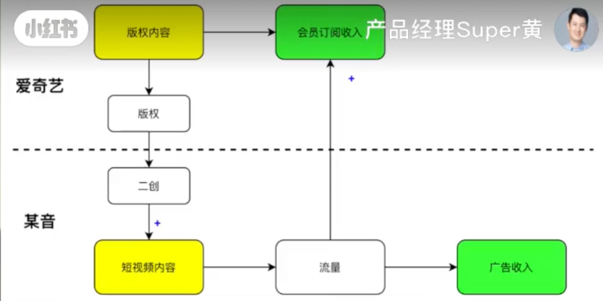

阅读 [DS/DA 全栈养成手册](https://jace-yang.github.io/Full-Stack_Data-Analyst/intro.html) 所作的笔记

## 商业分析

### 产品分析

#### 微信

> **为什么只有微信不做开屏广告？**
{: .prompt-info }

1. **产品定位角度**：国民级IM软件 (Instant Messaging Software)
    > 微信创始人张小龙说在微信做开屏广告就像把用户想象成一个朋友，和最好的朋友见面，他每次贴一个广告，你先撕下来才跟他说话的感觉
    {: .prompt-tip }
    - 社交软件的核心在**网络效应**：用户使用微信的主要原因是因为好友都在上面。在打开微信 -> 聊天的过程中插入开屏广告会降低聊天效率，减低用户体验，使用户数量下降，网络效应下降，产品价值随之下降
        > 网络效应：指随着使用某种产品或服务的用户数量增加，该产品或服务的价值也随之增加的现象
2. **商业模式角度**
    - 微信在连接用户的基础上，以公众号、小程序、视频号等渠道连接商家。微信巨大的用户量+额外内容服务获得的收益远远比开屏广告更可持续
    - 其他产品：
        - 抖音：早期为**流量广告**商业模式（目前已发展为以电商为核心，广告作为电商配套服务的多元模式），开屏广告设计成沉浸式内容，将广告内容化从而降低对用户体验的伤害，做到了商业价值和用户价值的平衡
        > *流量广告商业模式*：依托自身积累的庞大用户量，通过向广告主提供广告展示、投放等服务，将流量转化为商业收入的一种变现模式，其核心是把用户注意力转化为广告价值，常见计费方式有按千次展示收费（CPM--Cost per Mille）、按点击收费（CPC--Cost per Click）、按用户行动收费（CPA--Cost per Action）等
        - Spotify, Netflix之类的产品使用了**增值付费**和**内容付费**的商业模式，也需要保证用户在使用上的优质体验，再售卖额外的服务和内容来获得商业价值，所以没有开屏广告

#### 抖音

##### 产品调性

1. **内容层面**：从潮流娱乐到全品类覆盖，兼顾趣味与价值
2. **用户层面**：全民参与的低门槛创作，凸显普遍惠及与互动
3. **商业层面**：内容与商业深度融合，兼顾体验与转化
   - **无违和商业植入**：将电商、本地生活服务与内容深度绑定。如：达人在美食探店视频挂载套餐链接；美妆博主推荐化妆品时附上购买入口，这种植入方式契合用户内容消费场景，降低用户抵触感  
   - **闭环化交易体验**：平台构建起了 ”内容浏览 -> 兴趣激发 -> 下单购买“ 的完整电商闭环，用户无需跳转外部平台就可以完成商品购买、服务预约等操作，高效地将流量转化为商业价值，同时保障了用户体验。
4. **运营层面**：热点驱动的中心化分发，强化新鲜与时效

##### 产品优势

1. **技术算法**：
   - **精准推荐**：通过神经网络深度分析用户行浏览、点赞、评论等行为数据，精准挖掘用户兴趣偏好，能够捕捉用户的兴趣变化，把契合当下兴趣的内容精准推送给用户。
2. **产品设计**：
   - **低门槛**：提供丰富的特效、滤镜、一键成片模板，普通人不需要专业技能也可以快速创作短视频。
   - **强沉浸**：用户刷视频单列上划操作简单，不用思考筛选内容，并且后续内容有类似于抽奖的随机性，极大的提升用户使用时的沉浸感。
3. **内容生态**：
   - **全民创作**：平台推出创作者激励计划，提供流量扶持、现金奖励等。UG (User-generated content 用户生产内容)、PGC (Professionally-generated content 专业生产内容)，以及OGC ( Occupationally-generated Content 品牌生产内容) 共同发力，让内容池持续扩张。
   - **品类全面**：从早期的音乐创意短视频、拓展到娱乐、美食、知识科普、母婴育儿等许多垂直领域，既能满足用户碎片化娱乐需求，也能提供学习、解决实际问题的实用内容，适配不同年龄段的圈层的用户
4. **商业生态**：
   - **闭环模式**：用户无需跳转外部平台就可以完成商品购买、服务预约等操作，提升了转化率。
   - **多元变现**：各种商家推广、广告合作、直播带货、商品橱窗等多种途径变现。
5. **用户规模**：基数庞大，覆盖广泛。

##### 产品局限

1. **内容质量失衡**：低质和同质化内容太多并且更容易获得曝光，优质内容的生存空间被挤压。
2. **电商商品品控和售后问题突出**：内容带货模式使得部分商家为了盈利而忽视品质问题。
3. **不透明的流量分配机制**：中小创作者很难获得自然曝光，往往需要付费购买流量，导致新人创作者难以成长。
4. **原创保护不足**：热门内容被批量复制和抄袭。内容一经走红就被大量模仿搬运，但平台对原创内容保护措施不足，维权成本高。
5. **社交属性**：微信是刚需，但抖音并非刚需（**私域只有微信，流量还有很多平台可选**）

> **问**：怎么看待走音和长视频平台的版权二创合作？
>
> - 长短视频可以互相配合：
>   - 长视频主打深度内容、提供沉浸式体验，适合建立忠实粉丝和深度知识分享；短视频主打“短平快”，适合碎片化娱乐、快速传播和流量获取
>   - 长视频需要发展短视频生态，因为用户已经对长短视频有了心智和场景的区分：比如中午吃饭刷短视频，晚上看网络综艺和电影。
>   - 长视频也需要从站外导流，通过短视频流量来增加曝光率，吸引新用户来增加会员订阅收入。
>   
> - 公司角度：爱奇艺广告收入逐年下滑，会员营收增加
{: .prompt-info}

