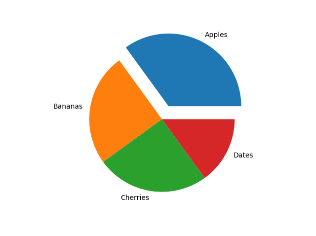

Notes were taken from [W3Schools](https://www.w3schools.com/python/matplotlib_intro.asp)

> Matplotlib is a low level graph plotting library in python that serves as a visualization utility
{: .prompt-info}
> **Most of the Matplotlib utilities lies under the `pyplot` submodule**  
> *detailed API reference: [matplotlib.pyplot](https://matplotlib.org/stable/api/pyplot_summary.html)*
{: .prompt-tip}

``` python
import matplotlib.pyplot as plt
```

## Plotting

### Plotting x and y points

`plot()` function is used to draw points (markers) in a diagram

> By default, `plot()` draws a line from a point to point

The function takes parameters for specifying points in the diagram

- Parameter 1 is an *array* containing the points on the **x-axis**
- Parameter 2 is an *array* containing the points on the **y-axis**

> If we do not specify the points on the x-axis, they will get the default values 0, 1, 2, 3 etc., depending on the length of the y-points.
{: .prompt-tip}

``` python
import matplotlib.pyplot as plt
import numpy as np

# Draw a line in a diagram from position (0, 0) to (6, 250):
xpoints = np.array([0, 6])
ypoints = np.array([0, 250])

plt.plot(xpoints, ypoints)
plt.show()
```

### Plotting without line

To plot only the markers, you can use shortcut string notation parameter `o`, which means 'rings'.

``` python
import matplotlib.pyplot as plt
import numpy as np

xpoints = np.array([1, 8])
ypoints = np.array([3, 10])

# Draw two points in the diagram
plt.plot(xpoints, ypoints, 'o')
plt.show()
```

### Multiple Points

> Can plot as many points as you like, given there is same number of points in both axis
{: .prompt-tip}

``` python
import matplotlib.pyplot as plt
import numpy as np

xpoints = np.array([1, 2, 6, 8])
ypoints = np.array([3, 8, 1, 10])

plt.plot(xpoints, ypoints)
plt.show()
```

## Markers

You can use the keyword argument `marker` to emphasize each point with a specified marker

``` python
plt.plot(xpoints, ypoints, marker='o')
```

### Format Strings

You can also use the **shortcut string notation** parameter `fmt` to specify the marker, written in the syntax : `marker|line|color`

``` python
import matplotlib.pyplot as plt
import numpy as np

ypoints = np.array([3, 8, 1, 10])

plt.plot(ypoints, 'o:r')
plt.show()
```

### Marker Size

use the keyword argument `markersize` or the shorter version, `ms` to set the size of the markers

```python
import matplotlib.pyplot as plt
import numpy as np

ypoints = np.array([3, 8, 1, 10])

plt.plot(ypoints, marker = 'o', ms = 20)
plt.show()
```

### Marker Color

- use the keyword argument `markeredgecolor` or the shorter `mec` to set the **color of the edge of the markers**

  ``` python
  import matplotlib.pyplot as plt
  import numpy as np

  ypoints = np.array([3, 8, 1, 10])

  plt.plot(ypoints, marker = 'o', ms = 20, mec = 'r')
  plt.show()
  ```

- use the keyword argument `markerfacecolor` or the shorter `mfc` to set the **color inside the edge of the markers**

  ``` python
  import matplotlib.pyplot as plt
  import numpy as np

  ypoints = np.array([3, 8, 1, 10])

  plt.plot(ypoints, marker = 'o', ms = 20, mfc = 'r')
  plt.show()
  ```

## Line

### Linestyle

use the keyword argument `linestyle`, or shorter `ls`, to change the **style of the plotted line**

``` python
import matplotlib.pyplot as plt
import numpy as np

ypoints = np.array([3, 8, 1, 10])

plt.plot(ypoints, linestyle = 'dotted')
plt.show()
```

### Line Color

use the keyword argument `color` or the shorter `c` to set the **color of the line**

```python
import matplotlib.pyplot as plt
import numpy as np

ypoints = np.array([3, 8, 1, 10])

plt.plot(ypoints, color = 'r')
plt.show()
```

### Line Width

use the keyword argument `linewidth` or the shorter `lw` to change the width of the line

``` python
import matplotlib.pyplot as plt
import numpy as np

ypoints = np.array([3, 8, 1, 10])

plt.plot(ypoints, linewidth = '20.5')
plt.show()
```

### Multiple Lines

Plot as many lines as you like by simply adding more `plt.plot()` functions

``` python
import matplotlib.pyplot as plt
import numpy as np

y1 = np.array([3, 8, 1, 10])
y2 = np.array([6, 2, 7, 11])

plt.plot(y1)
plt.plot(y2)

plt.show()
```

Can also plot many lines by adding the points for the x- and y-axis for each line in the same plt.plot() function

``` python
import matplotlib.pyplot as plt
import numpy as np

x1 = np.array([0, 1, 2, 3])
y1 = np.array([3, 8, 1, 10])
x2 = np.array([0, 1, 2, 3])
y2 = np.array([6, 2, 7, 11])

plt.plot(x1, y1, x2, y2)
plt.show()
```

## Marker/Line/Color Options

**Marker options:**

| Marker Syntax | Description    |
| :------------ | :------------- |
| `o`           | Circle         |
| `*`           | Star           |
| `.`           | Point          |
| `,`           | Pixel          |
| `x`           | X              |
| `X`           | X (filled)     |
| `+`           | Plus           |
| `P`           | Plus (filled)  |
| `s`           | Square         |
| `D`           | Diamond        |
| `s`           | Diamond (thin) |
| `p`           | Pentagon       |
| `H`           | Hexagon        |
| `h`           | Hexagon        |
| `v`           | Triangle Down  |
| `^`           | Triangle Up    |
| `<`           | Triangle Left  |
| `>`           | Triangle Right |
| `1`           | Tri Down       |
| `2`           | Tri Up         |
| `3`           | Tri Left       |
| `4`           | Tri Right      |
| `\|`          | Vline          |
| `_`           | Hline          |

**Line Options:**

| Line Syntax             | Description        |
| :---------------------- | :----------------- |
| `-` / `solid` (default) | Solid Line         |
| `:` / `dotted`          | Dotted Line        |
| `--` / `dashed`         | Dashed Line        |
| `-.` / `dashdot`        | Dashed/dotted Line |
| `None`                  | No line            |

**Color Options:**

| Color Syntax | Description |
| :----------- | :---------- |
| `r`          | Red         |
| `g`          | Green       |
| `b`          | Blue        |
| `c`          | Cyan        |
| `m`          | Magenta     |
| `k`          | Black       |
| `w`          | White       |

> or hexademical color values/any of the supported color names
{: .prompt-tip}

## Labels and Title

### Create Lables for a Plot

Use the `xlabel()` and `ylabel()` functions to set a label for the x and y-axis

``` python
plt.xlabel("X label")
plt.ylabel("Y labelß")
```

### Create Title for a Plot

Use the `title()` function to set a title fot the plot

``` python
plt.title("Title")
```

### Set Font Properties for Title and Labels

use `fontdict` parameter in `xlabel()`, `ylabel()` and `title()` to set the properties for title and labels

``` python
font1 = {'family':'serif','color':'blue','size':20}
font2 = {'family':'serif','color':'darkred','size':15}

plt.title("Sports Watch Data", fontdict = font1)
plt.xlabel("Average Pulse", fontdict = font2)
plt.ylabel("Calorie Burnage", fontdict = font2)
```

### Position the title

use `loc` parameter in `title()` to position the title
> `left`, `right` or `center`(default)

``` python
plt.title("Title", loc = "left")
```

## Adding Grid Lines

use the `grid()` function to add grid lines to the plot

``` python
plt.grid()
```

### Specify Grid Lines to Display

Use the `axis` parameter in the `grid()` function to specify which grid lines to display
> `x`, `y` and `both`(default)

``` python
plt.grid(axis = 'x')
```

### Set Grid Line Properties

set the line properties of the grid using:  `grid(color = 'color', linestyle = 'linestyle', linewidth = number)`.

``` python
plt.grid(color = 'green', linestyle = '--', linewidth = 0.5)
```

## Subplot

### Display Multiple Plots

Draw multiple plots in one figure using `subplot()` function

```python
# Draw 2 Plots:
import matplotlib.pyplot as plt
import numpy as np

#plot 1:
x = np.array([0, 1, 2, 3])
y = np.array([3, 8, 1, 10])

plt.subplot(1, 2, 1)
plt.plot(x,y)

#plot 2:
x = np.array([0, 1, 2, 3])
y = np.array([10, 20, 30, 40])

plt.subplot(1, 2, 2)
plt.plot(x,y)

plt.show()
```

### subplot() arguments

`subplot()` function takes 3 arguments that describes the layout of the figure

- argument 1 represents the rows
- argument 2 represents the columns
- argument 3 represents the index of the current plot

``` python
plt.subplot(1, 2, 1)
#the figure has 1 row, 2 columns, and this plot is the first plot.

plt.subplot(1, 2, 2)
#the figure has 1 row, 2 columns, and this plot is the second plot.
```

### Subplot title & supertitle

- Add a title to **each plot** with the `title()` function
- Add a title to the **entire figure** with the `suptitle()` function

``` python
import matplotlib.pyplot as plt
import numpy as np

#plot 1:
x = np.array([0, 1, 2, 3])
y = np.array([3, 8, 1, 10])

plt.subplot(1, 2, 1)
plt.plot(x,y)
plt.title("SALES")

#plot 2:
x = np.array([0, 1, 2, 3])
y = np.array([10, 20, 30, 40])

plt.subplot(1, 2, 2)
plt.plot(x,y)
plt.title("INCOME")

plt.suptitle("MY SHOP")
plt.show()
```

## Scatter

User the `scatter()` function to draw a scatter plot
> The `scatter()` function plots one dot for each observation. It needs two arrays of the same length, one for the values of the x-axis, and one for values on the y-axis

``` python
import matplotlib.pyplot as plt
import numpy as np

x = np.array([5,7,8,7,2,17,2,9,4,11,12,9,6])
y = np.array([99,86,87,88,111,86,103,87,94,78,77,85,86])

plt.scatter(x, y)
plt.show()
```

### Compare Plots

``` python
import matplotlib.pyplot as plt
import numpy as np

#day one, the age and speed of 13 cars:
x = np.array([5,7,8,7,2,17,2,9,4,11,12,9,6])
y = np.array([99,86,87,88,111,86,103,87,94,78,77,85,86])
plt.scatter(x, y)

#day two, the age and speed of 15 cars:
x = np.array([2,2,8,1,15,8,12,9,7,3,11,4,7,14,12])
y = np.array([100,105,84,105,90,99,90,95,94,100,79,112,91,80,85])
plt.scatter(x, y)

plt.show()
```

### Colors

#### Overall Color

set your own color for each scatter plot with the `color` or the `c` argument

``` python
import matplotlib.pyplot as plt
import numpy as np

x = np.array([5,7,8,7,2,17,2,9,4,11,12,9,6])
y = np.array([99,86,87,88,111,86,103,87,94,78,77,85,86])
plt.scatter(x, y, color = 'hotpink')

x = np.array([2,2,8,1,15,8,12,9,7,3,11,4,7,14,12])
y = np.array([100,105,84,105,90,99,90,95,94,100,79,112,91,80,85])
plt.scatter(x, y, color = '#88c999')

plt.show()
```

#### Color Each Dot

Set a specific color for each dot by using an array of colors as value for the `c` argument
> Cannot use the `color` argument, only `c` argument
{: .prompt-warning}

``` python
import matplotlib.pyplot as plt
import numpy as np

x = np.array([5,7,8,7,2,17,2,9,4,11,12,9,6])
y = np.array([99,86,87,88,111,86,103,87,94,78,77,85,86])
colors = np.array(["red","green","blue","yellow","pink","black","orange","purple","beige","brown","gray","cyan","magenta"])

plt.scatter(x, y, c=colors)

plt.show()
```

### Color Map

Specify the colormap with the keyword argument `cmap` with the value of the colormap, in this case `viridis` which is one of the built-in colormaps available in Matplotlib

```python
import matplotlib.pyplot as plt
import numpy as np

x = np.array([5,7,8,7,2,17,2,9,4,11,12,9,6])
y = np.array([99,86,87,88,111,86,103,87,94,78,77,85,86])

# Create a color array, and specify a colormap in the scatter plot
colors = np.array([0, 10, 20, 30, 40, 45, 50, 55, 60, 70, 80, 90, 100])

plt.scatter(x, y, c=colors, cmap='viridis')

plt.show()
```

> Include the colormap in the drawing by including the `plt.colorbar()` statement
{: .prompt-info}

#### Available ColorMaps

[Colormap Reference](https://matplotlib.org/stable/gallery/color/colormap_reference.html)

### Size

Change the size of the dots with the `s` argument

```python
plt.scatter(x, y, s=sizes)
```

### Alpha

Adjust the transparency of the dots with the `alpha` argument

```python
sizes = np.array([20,50,100,200,500,1000,60,90,10,300,600,800,75])
plt.scatter(x, y, s=sizes, alpha=0.5)
```

## Bars

- Use the `bar()` function to draw bar graphs
- Use `barh()` funtion to display the bars horizontally

```python
import matplotlib.pyplot as plt
import numpy as np

# Draw 4 bars
x = np.array(["A", "B", "C", "D"])
y = np.array([3, 8, 1, 10])

plt.bar(x,y)
plt.show()
```

### Color

`bar()` and `barh()` take the keyword argument `color` to set the color of the bars

```python
plt.bar(x, y, color = "red")
```

### Width

`bar()` takes the keyword argument width to set the width of the bars (default width = 0.8)

```python
plt.bar(x, y, width = 0.1)
```

> For horizontal bars `barh()`, use `height` instead of `width`
{: .prompt-tip}

## Histograms

Use the `hist()` function to create histograms

``` python
import matplotlib.pyplot as plt
import numpy as np

x = np.random.normal(170, 10, 250)

plt.hist(x)
plt.show() 
```

> `bins` argument is used to set the number of bins
{: .prompt-tip}

## Pie Charts

Use the `pie()` function to draw pie charts

```python
import matplotlib.pyplot as plt
import numpy as np

y = np.array([35, 25, 25, 15])

plt.pie(y)
plt.show() 
```

### Labels

Add labels to the pie chart with the `labels` parameter

> `labels` parameter must be an array with one label for each wedge
{: .prompt-warning}

```python
mylabels = ["Apples", "Bananas", "Cherries", "Dates"]
plt.pie(y, labels = mylabels)
```

### Start Angle

- Default start angle is at the x-axis, change the start angle by specifying a `startangle` parameter
- The `startangle` parameter is defined with an angle in degrees, default angle is 0:

  

``` python
import matplotlib.pyplot as plt
import numpy as np

y = np.array([35, 25, 25, 15])
mylabels = ["Apples", "Bananas", "Cherries", "Dates"]

# Start the first wedge at 90 degrees
plt.pie(y, labels = mylabels, startangle = 90)
plt.show() 
```

### Explode

The `explode` parameter allows you to make one of the wedges stand out.

> - The `explode` parameter, if specified, and not `None`, must be an array with one value for each wedge.
> - Each value represents how far from the center each wedge is displayed
{: .prompt-tip}

```python
import matplotlib.pyplot as plt
import numpy as np

y = np.array([35, 25, 25, 15])
mylabels = ["Apples", "Bananas", "Cherries", "Dates"]
# Pull the "Apples" wedge 0.2 from the center of the pie
myexplode = [0.2, 0, 0, 0]

plt.pie(y, labels = mylabels, explode = myexplode)
plt.show() 
```



### Shadow

Add a shadow to the pie chart by setting the `shadows` parameter to `True`

```python
plt.pie(y, labels = mylabels, shadow = True)
```

### Colors

Set the color of each wedge with the `colors` parameter.

> The `colors` parameter, if specified, must be an array with one value for each wedge
{: .prompt-tip}

```python
mycolors = ["black", "hotpink", "b", "#4CAF50"]
plt.pie(y, labels = mylabels, colors = mycolors)
```

### Legend

`legend()` function adds a list of explanation for each wedge

- `title` parameter: add header to the legend
  

``` python
plt.legend(title = "Four Friuts:")
```
