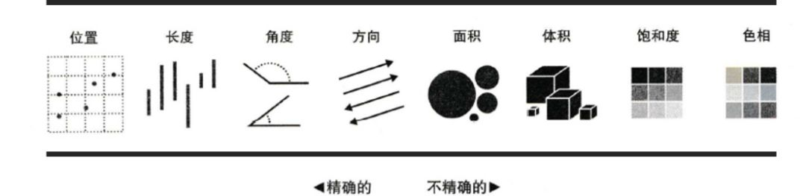

## Tableau 介绍

- 数据可视化
- 数据赋能
    > 让业务一线也可以轻松使用最新数据
    {: .prompt-info}
  - 分析师可以将数据看板发布到线上
  - 自动更新看板
  - 自由下载数据
  - 线上修改图表
  - 邮箱发送数据
  - 设置数据预警
- 数据探索
    > 通过统计分析和数据可视化，从数据发现问题，用数据验证假设
    {: .prompt-info}
  - 支持亿级数据的连接和处理
  - 自由地对字段进行各种计算
  - 拖拽就可以轻松制作图表
  - 数据可以随意聚合下钻（聚合——查看汇总数据；下钻——查看更细粒度的数据）
  - 图表类型可以灵活转换
  - 内置算法智能建模

## 数据可视化原理

- 数据 ➡️ 图形
- 数据有**维度**和**度量**两种类型
  - 维度 (Dimensions)
    > 类别类型 (e.g. 用户ID、 性别、 来源渠道), 主要用来对数值变量的计算结果进行区分，表现为图表的颜色种类、图形位置、分类方式等难以量化的视觉元素, 只能进行计数和分布等简单计算
    {: .prompt-tip}
  - 度量 (Measures)
    > 数值类型 (e.g. 成交金额、 用户数、 点击量)，可以进行计算并基于计算结果的大小表示图表的面积大小、条形长短、颜色深浅等可以量化的视觉元素
    {: .prompt-tip}
- 数据可映射的图形类型
  - 位置
    > 位置是通过将两个**度量**分别作为x坐标和y坐标确认某一**维度**变量的位置，从而形成空间关系来表现该**维度**变量的分布和趋势
  - 长度
    > 长度是直接以图形的长度来衡量**度量**的大小，并以**维度**做区分，以此实现各**维度**下对**度量**的对比分析
  - 角度
    > 角度和弧长都是用**度量**的大小直接衡量，表现细分**维度**和整体间的关系
  - 方向
    > 方向是对趋势的描述，以折线图最为典型，以时间**维度**作为横轴，表现各时间**维度**下某一**度量**的高低变化，高低之间的连线就形成了方向
  - 形状
    > 形状主要用于在多组数据分析时区别组别**维度**，我们在日常使用时又称之为标记，比如散点图和折线图中的形状：
  - 面积和体积
    > 面积体积越大则表示**度量**越大。长度、面积、体积都可以表示数值的大小。二维平面通常用圆形和矩形，三维空间一般用立方体或球体
  - 颜色和深浅
    > 饱和度和色调是两个颜色的关键要素，既可以用来区分**维度**也可以用来表示**度量**的数值的高低
- [可视化词典](https://public.tableau.com/views/VisualVocabulary_15517745167960/VisualVocabulary?%3Alanguage=en&%3Aembed=y&%3Adisplay_count=y&%3AshowVizHome=no#!/vizhome/VisualVocabulary/Flow)
- 贝尔实验室】在1985年发布了视觉元素的暗示排序清单：
  
- 依次对应数据可视化领域的四大金刚：散点图、柱状图/条形图、饼图、折线图

## 基础图表制作

- **对比分析：** 比大小
  - 柱状图
  - 条形图
  - 热力图
  - 气泡图
  - 词云
- **变化分析：** 看趋势
  - 折线图
  - 面积图
- **构成分析：** 看占比
  - 饼图
  - 树地图
  - 堆积图
- **关系分布：** 看位置
  - 散点图
  - 直方图
  - 地图

## 数据可视化原则

- 区分用户
  - 判断观众是谁，选择分析和展示的角度
- 主次分明，详略得当
  - 用恰当的方式强调恰当的内容
- 真实准确
  - 坐标轴从0开始等等
- 符合大众认知和审美习惯
- 适度原则
  - 颜色不要超过8种，不能过分强调，，且搭配合理
  - 排版、字体、大小、形状等都要合适
  - 避免使用3D效果，容易产生错觉
- 五秒原则
  - 做的图5秒内其他人看懂了就是成功了，否则还有优化空间
- 恰到好处的说明
  - 标题、图例、标注、结论等 (Tableau 通过右键添加注释)
- Less is More
